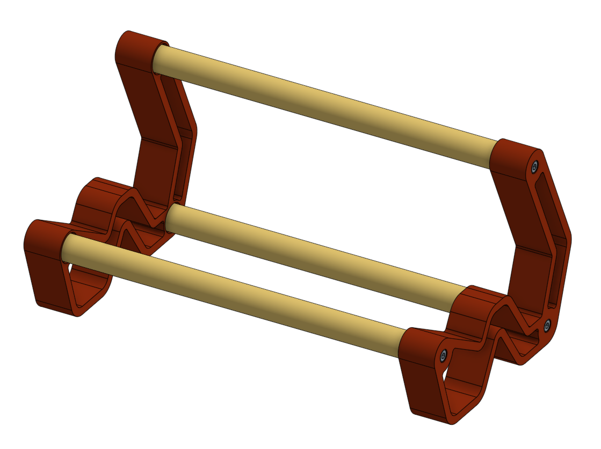
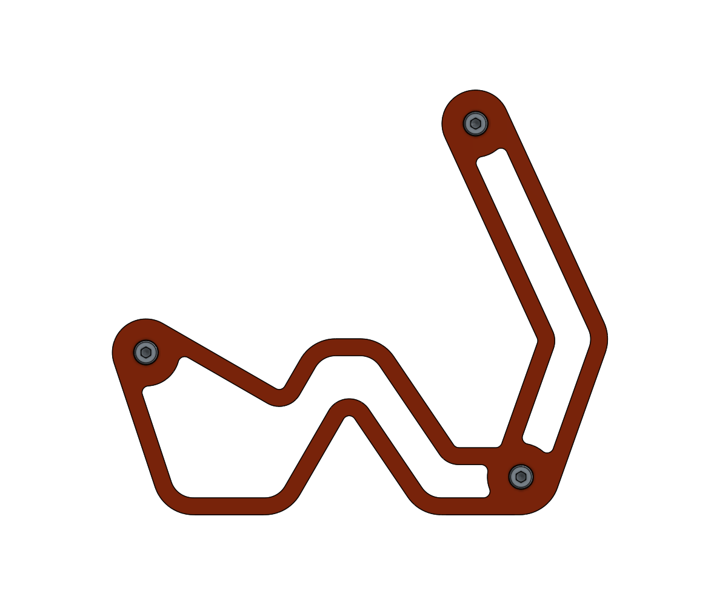
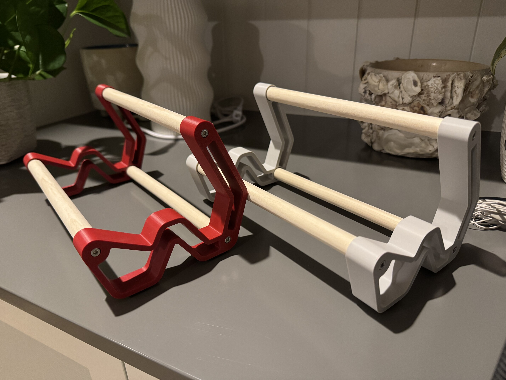

# Keeb Keeper

A desktop display stand for your keyboard you can make with a 3D printer and a trip to the hardware store. Please, don't tell anyone that I'm this big of a nerd about keyboards.

## BOM

| Part | Quantity | Price | Link |
| --- | --- | --- | --- |
| M4 10mm wood threaded insert nuts | 6 | $7.29 (for a kit) | [link](https://www.amazon.com/dp/B07GKG23QH?ref=ppx_yo2ov_dt_b_fed_asin_title)
| M4x25mm socket head screws | 6 | $8.99 (for a kit) | [link](https://www.amazon.com/dp/B0DCVVNMQP?ref_=ppx_hzsearch_conn_dt_b_fed_asin_title_2&th=1)
|5/8ths inch (~16mm) diameter wooden dowel | 3x 215mm | $8.99 (for a kit) | [link](https://www.amazon.com/Yaliuliu-10PCS-Dowel-Sticks-Wooden/dp/B0CQK2GX3Q/ref=sr_1_2?crid=2DT3EBG76R3BZ&dib=eyJ2IjoiMSJ9.KlwKemKXTM5K1Hglk43RXNYDrSNG_66bds32NTpZQw0rqoYz9Xdq2bm2KoHiIIFYjmhUctSVZGjVAiL0Ivq8ObhmFb7mCJ8nMt6ZmOuyR3XbzzmkMh6abNWbIFtMrv89Pi724FsQoQR7kU1q-t5c1M7to6ZPg2bAG916FtajHZpSpvwIuVV1h4uMUBGG1rhL2Uw7DKLSry7wPdHIRSmelAlQsH1cr6xgYF2oNdJZxE3lI_9dT26AMhoyMP4_io0oTmJwf2kTtWsXghNtckHy20Ko90s7uD4xZVnJELOmwXw.pGOxiPj4DggGWaddI8nrHm44jx2KfaueCPdroLGwjyQ&dib_tag=se&keywords=5%2F8%2Bwooden%2Bdowel&qid=1766817597&sprefix=5%2F8%2Bwooden%2Bdowel%2Caps%2C201&sr=8-2&th=1)
| Left and right side brackets | 1 each | ~80g of PLA ~$2 | See CAD

## CAD

See `cad/` for STEP files of the brackets as well as a `.gcode.3mf` file for the PLA print configuration on my Bambu X1C. 

## Assembly

1. Cut wooden dowels to length (I picked 215mm, yours could be longer or shorter depending on your keyboards or preferences). I did this with a hand saw which lead to cuts which weren't quite perpendicular to the dowel's long axis and thats not ideal, better to use a tablesaw or bandsaw for this.
2. Drill centered holes into both sides of the dowel and install threaded inserts, the included `drill-guide.step` model can be printed to use as a guide to keep a handheld power drill on-axis. I used a quarter-inch drill bit for my M4 threaded inserts, this worked surprisingly well keeping my drill bit lined up but not deteriorating as I drilled through a bunch of dowels.
3. Give the dowels a sanding, I did this by hand with 400 grit sandpaper.
3. 3D print the brackets.
4. Final assembly, install M4 hardware to fasten the brackets to the 3 dowels, profit.
